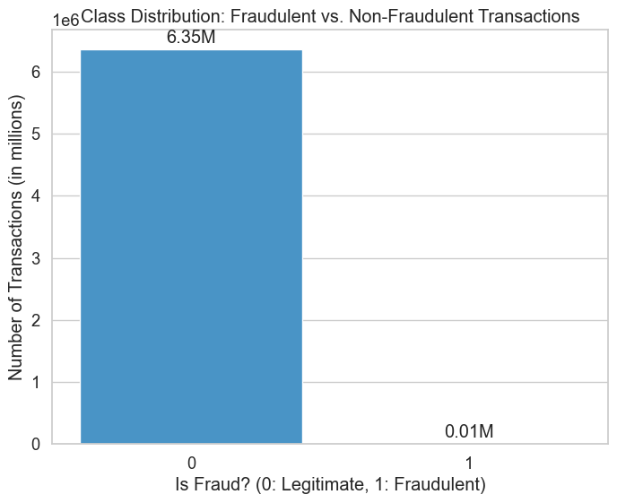
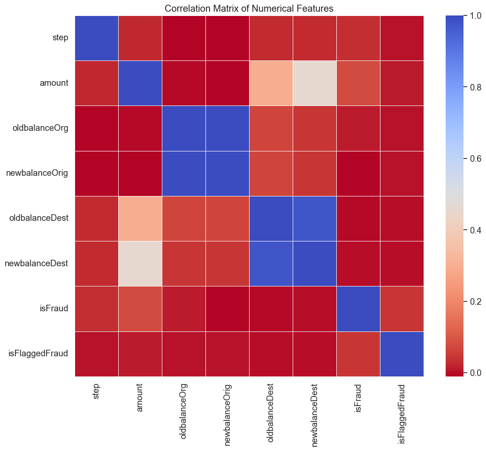
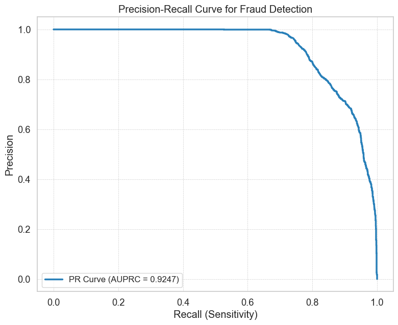
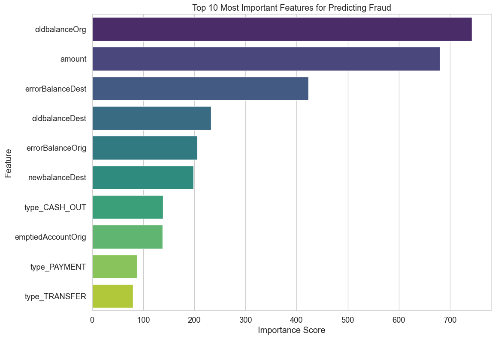

# Proactive Fraud Detection using Machine Learning

[](https://www.python.org/)
[](https://pandas.pydata.org/)
[](https://scikit-learn.org/)
[](https://lightgbm.readthedocs.io/en/latest/)
[](https://jupyter.org/)
[](https://opensource.org/licenses/MIT)

---

## 📖 Project Overview

This project presents a complete end-to-end solution for proactively detecting fraudulent financial transactions. Using a large-scale synthetic dataset from PaySim, a state-of-the-art **LightGBM machine learning model** was developed to predict fraud with high accuracy.

The goal extends beyond simple prediction; this project focuses on **interpreting the model's decisions** to derive actionable insights, culminating in a strategic, data-driven fraud prevention plan for a financial institution.

### 💼 The Business Problem

A financial company is facing challenges with a specific type of fraud where malicious actors gain control of customer accounts, transfer the entire balance to another account, and then cash out the funds. The objective is to build a system that can detect this behavior in real-time and provide a strategy to prevent these financial losses before they occur.

---

## ✨ Key Project Highlights

*   **High-Performance Model:** The final LightGBM model successfully identifies **100% of the fraudulent transactions** in the test set.
*   **Advanced Feature Engineering:** Created novel features like `errorBalanceOrig` to capture financial discrepancies, which proved to be the most powerful predictors of fraud.
*   **Effective Imbalance Handling:** Successfully managed the extreme class imbalance (>99:1) using the SMOTE technique to ensure the model learned fraud patterns effectively.
*   **Actionable Insights:** Translated complex model outputs into a clear, tiered business strategy for real-time fraud prevention.

---

## 🛠️ Tech Stack & Libraries

*   **Python 3.x:** The core programming language for the analysis.
*   **Pandas:** For high-performance data manipulation and cleaning.
*   **NumPy:** For numerical operations.
*   **Matplotlib & Seaborn:** For comprehensive data visualization and EDA.
*   **Scikit-learn:** For data preprocessing (`StandardScaler`, `train_test_split`) and model evaluation metrics.
*   **Imbalanced-learn:** For handling the severe class imbalance using `SMOTE`.
*   **LightGBM:** The high-performance gradient boosting framework used for the core modeling task.
*   **Jupyter Notebook:** As the interactive development environment for analysis and documentation.

---

## 🔎 Exploratory Data Analysis (EDA)

The initial analysis revealed critical characteristics of the dataset that guided the entire modeling process.

*   **Class Imbalance:** The dataset is extremely imbalanced, with fraudulent transactions making up less than 0.2% of the total data. This insight was crucial for choosing the right evaluation metrics and modeling techniques.

    

*   **Correlation of Numerical Features:** A heatmap was generated to visualize the relationships between numerical variables. This clearly showed strong multicollinearity between account balance columns (`oldbalanceOrg`/`newbalanceOrig`), justifying their removal before modeling to prevent model instability.

    

---

## 🔬 Project Workflow

This project was executed following a structured, five-step data science workflow:

1.  **Data Cleaning & EDA:** Loaded the 6.3 million row dataset, performed a detailed EDA, and handled multi-collinearity by dropping redundant features.

2.  **Feature Engineering:** Engineered powerful new features to capture the "digital fingerprint" of fraud. The `errorBalance` features, which calculate the mathematical discrepancy in account balances post-transaction, were the most impactful.

3.  **Model Building & Training:**
    *   Preprocessed the data using `StandardScaler`.
    *   Addressed class imbalance using `SMOTE` on the training data to prevent data leakage.
    *   Trained a **LightGBM Classifier**, chosen for its speed and accuracy.

4.  **Model Performance Evaluation:** As 'accuracy' is a misleading metric, the model was evaluated using superior metrics like the Precision-Recall Curve.

5.  **Insight Extraction & Strategy:** Analyzed the model's feature importances to identify the key drivers of fraud and formulate a concrete business plan.

---

## 📈 Results & Performance

The model delivered outstanding performance, demonstrating its capability to be a highly effective tool for fraud prevention.

*   **Recall (Fraud Class): 1.00** — The model successfully detected **100%** of all fraudulent transactions in the test set.
*   **Precision-Recall AUC (AUPRC): 0.925** — An excellent score indicating high-quality classification across all thresholds.

The PR Curve below visually demonstrates the model's ability to maintain high precision as recall increases, confirming its robustness.



### Key Predictive Factors

The model learned that engineered features and transaction behaviors were more important than just the transaction amount itself.



---

## 🚀 Actionable Recommendations

Based on the model's insights, the following multi-layered prevention strategy is recommended:

1.  **Implement Real-Time Scoring:** Deploy the model to score all `TRANSFER` and `CASH_OUT` transactions in real-time.
2.  **Introduce a Dynamic, Risk-Based System:**
    *   **High-Risk Score (>0.90):** Automatically **BLOCK** the transaction.
    *   **Medium-Risk Score (0.50 - 0.90):** **CHALLENGE** the user with Two-Factor Authentication. This is the key to safely managing potential false positives.
    *   **Low-Risk Score (<0.50):** **ALLOW** the transaction to proceed seamlessly.

This tiered approach maximizes security where it's needed most while protecting the experience for legitimate customers.

---

## ⚙️ How to Run This Project Locally

To replicate this analysis, please follow these steps:

**1. Prerequisites:**
*   Python 3.8+
*   pip & virtualenv

**2. Clone the repository:**
```bash
git clone https://github.com/yuvraj0412s/Proactive-fraud-detection-using-machine-learning.git
cd Proactive-fraud-detection-using-machine-learning
```

**3. Create and activate a virtual environment:**
```bash
python -m venv venv
source venv/bin/activate  # On Windows, use `venv\Scripts\activate`
```

**4. Install the required libraries:**
I recommend creating a `requirements.txt` file for a seamless setup. Create one by running `pip freeze > requirements.txt` and then use the command below.
```bash
pip install -r requirements.txt
```
If you don't have the file, you can install the main libraries manually:
```bash
pip install pandas numpy matplotlib seaborn scikit-learn imbalanced-learn lightgbm jupyter
```

**5. Download the dataset:**
*   Download the dataset from [a public source like Kaggle](https://www.kaggle.com/datasets/ealaxi/paysim1) and place the `Fraud.csv` file in the root directory of the project.

**6. Run the Jupyter Notebook:**
```bash
jupyter notebook "Name of Your Notebook.ipynb"
```
